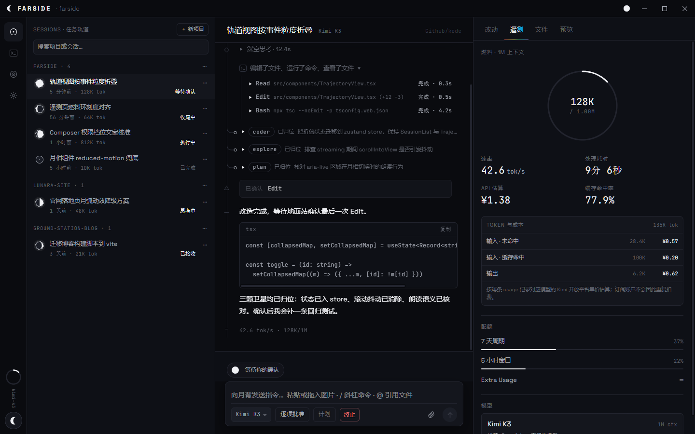
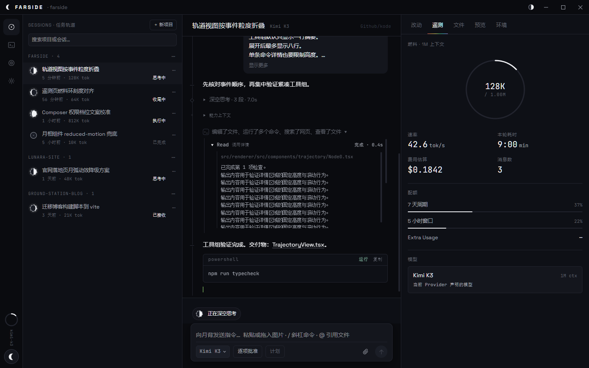
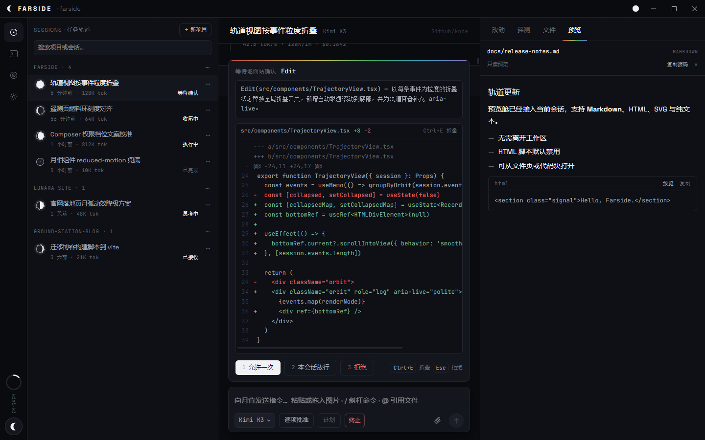
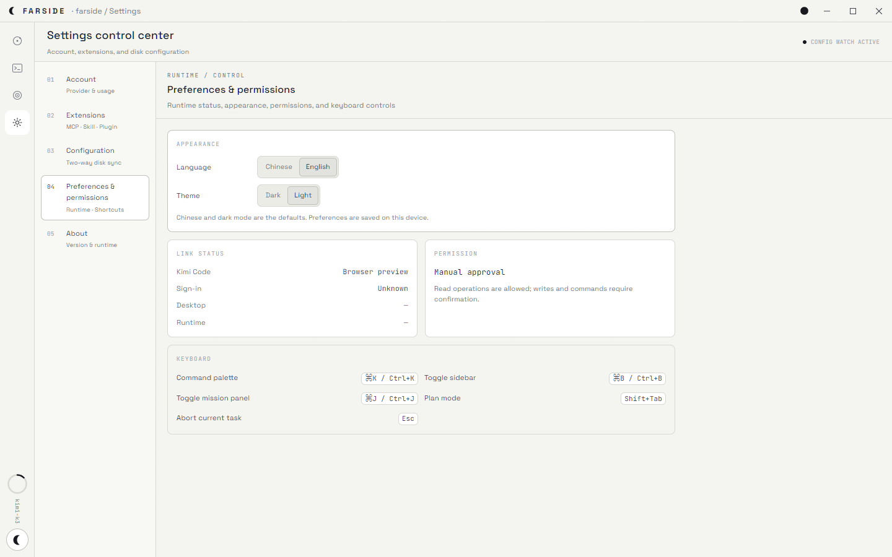

<h1> Farside（月背）</h1>

面向 [Kimi Code](https://github.com/MoonshotAI/kimi-code) 的桌面 Agent 客户端，基于 Electron、React 与 TypeScript 构建。

[](https://github.com/dandandujie/Farside/actions/workflows/release.yml)
[](LICENSE)

Farside 不把编程任务表现成普通聊天：月相表示 Agent 状态，会话是一条轨道时间线，思考是深空信号，工具是仪器读数，子代理是卫星。



## 界面预览

### 对话轨迹与紧凑工具详情



### 内置文件预览舱



### 中英文与明暗主题



## 特性

- **月相状态语言**：朔=空闲、上弦=思考、盈凸=执行、满月=等待批准、残月=收尾。
- **轨道时间线**：Transmission（思考）/ Instrument（工具）/ Satellite（子代理）/ Ground（用户指令）。
- **项目与会话管理**：基于 Kimi Workspace/Session，支持创建项目、资源管理器打开、重命名、置顶、归档、移除，以及会话置顶、归档、分叉与导出。
- **多模态与文件上下文**：图片、视频、工作区搜索和 `@文件` 引用。
- **结构化交互**：工具审批、单选/多选提问、Goal 暂停/恢复/取消，以及 Agent Swarm 事件展示。
- **命令面板 ⌘K**：斜杠命令与 Kimi Code CLI 对齐，支持动作、命令和会话搜索。
- **真实终端**：xterm.js；node-pty 缺失时自动降级到 shell 管道。
- **工程上下文**：实时文件树、文件内容、Git 状态与 diff、MCP 服务列表。
- **内置预览舱**：Markdown、HTML、SVG、图片与纯文本可在右侧栏直接预览；HTML 以禁用脚本的沙箱运行，图片支持缩放。
- **低噪声轨道**：连续工具活动默认聚合成一行；请求完成后只折叠中间处理过程，问题与最终答复保持可读。
- **真实消息边界**：`system-reminder`、运行时通知与能力上下文归入折叠的内部事件，不再伪装成用户请求气泡。
- **可调工作区**：会话栏、Mission Panel 与文件树均可鼠标拖动调整比例，宽度自动记忆。
- **多种账户接入**：Kimi OAuth、Moonshot 官方 API，以及 OpenAI 格式的第三方 Kimi 服务。
- **会员用量**：OAuth 账户显示当前套餐、5 小时窗口、周周期、Extra Usage 与官方升级入口。
- **账户与扩展中心**：左下角账户卡提供登录、退出和额度入口；设置页可管理 MCP、Skills、Plugins、环境文件与全局 AGENTS.md。
- **中英与明暗主题**：默认中文和暗黑模式，可即时切换英文或明亮模式，偏好保存在本机。
- **可审计 Agent Runtime**：安装包只有一套经版本、上游基线、来源与 SHA-256 锁定的 Runtime；以 Kimi Code 为核心，并在源码差异审查后适配 Farside 优化。
- **安全边界**：Kimi server 仅监听 loopback，Bearer token 只保存在 Electron 主进程。

## 开发

前置条件：Node.js 22.12 或更高版本，以及通过[官方脚本](https://github.com/MoonshotAI/kimi-code#install)安装的 Kimi Code。

```powershell
npm ci
npm run dev                 # 本地开发模式
npm test                    # 安全边界回归测试
npm run typecheck           # 主进程与渲染进程类型检查
npm run build               # 编译 Electron 应用
npm run runtime:prepare     # 校验并复制唯一锁定的 Runtime
npm run runtime:smoke       # 在隔离目录启动并验证 Kimi Server
npm run runtime:upstream:check # 只检查 Kimi Code 上游变化，不自动更新
npm run dist                # 为当前操作系统生成安装包
```

本地开发可使用与锁定版本一致的源码构建产物，或用 `FARSIDE_KIMI_BINARY` 显式指定；正式打包应设置 `FARSIDE_DOWNLOAD_KIMI_RUNTIME=1`。CI 只下载 `runtime.lock.json` 中唯一 `current` 产物，校验 SHA-256 后再打包。随包 runtime 启动前还会复核内嵌锁文件、manifest 与文件完整性，服务就绪后核对 `/api/v1/meta` 的版本和能力。Kimi Code 上游升级只触发差异审查，不会自动替换 Farside Runtime。完整适配流程见 [Runtime 维护指南](RUNTIME.md)。

Kimi Code 0.28.0 的源码与桌面服务生命周期适配已完成，正在等待 Farside 自有六平台 runtime 产物及剩余发布门禁；当前安装包仍锁定已验证的 0.27.0，不会临时换成官方 0.28.0 release。

## 结构

```text
src/main/       Electron 主进程（窗口、IPC、Kimi REST/WS 客户端、server、PTY）
src/preload/    contextBridge（window.api，类型契约位于 src/shared/ipc.ts）
src/shared/     跨进程类型与 IPC 契约
src/renderer/   React 界面、状态仓库、设计系统与功能组件
scripts/        runtime 准备、图标与视觉回归脚本
```

## 致谢

- [Kimi Code CLI](https://github.com/MoonshotAI/kimi-code) by Moonshot AI（月之暗面）

## 许可证

Farside 以 [MIT License](LICENSE) 开源；随包 Kimi Code runtime 保留其原始 MIT 许可证与来源说明。

## 友情链接

- [LINUX DO](https://linux.do)
